# NAPOS

## Developers

### Programmers
Reece Cristea, Jacob Myers, Alec Ross.

### Special Thanks
Anis Syazana - App icon/logo.

## Project
### Overview
(This project is no longer being developed, and missing intended features.)

Many small businesses have trouble accessing a digital system to help them carry out their services. On top of that, some existing point of sale (POS) systems can be unintuitive and difficult to use, which hinders the productivity of businesses utilizing them.

The goal of this project is to make an efficient, user-friendly restaurant point of sale system that is easily accessible to small businesses. This will serve to increase productivity, accessibility and reduce difficulty in the workplace.

### User interface and functionality
App and icon:
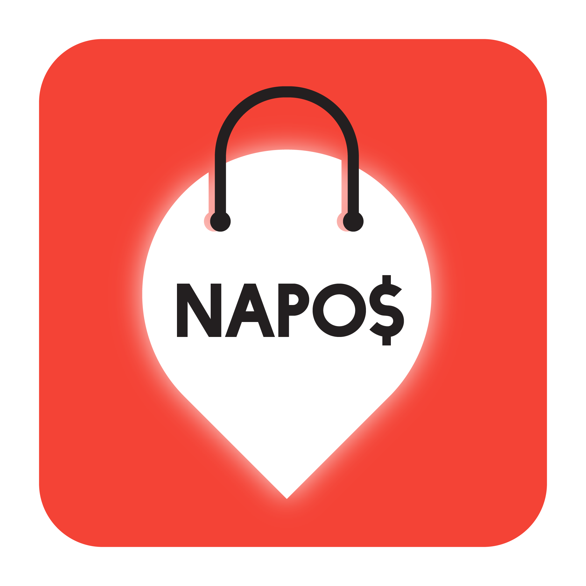
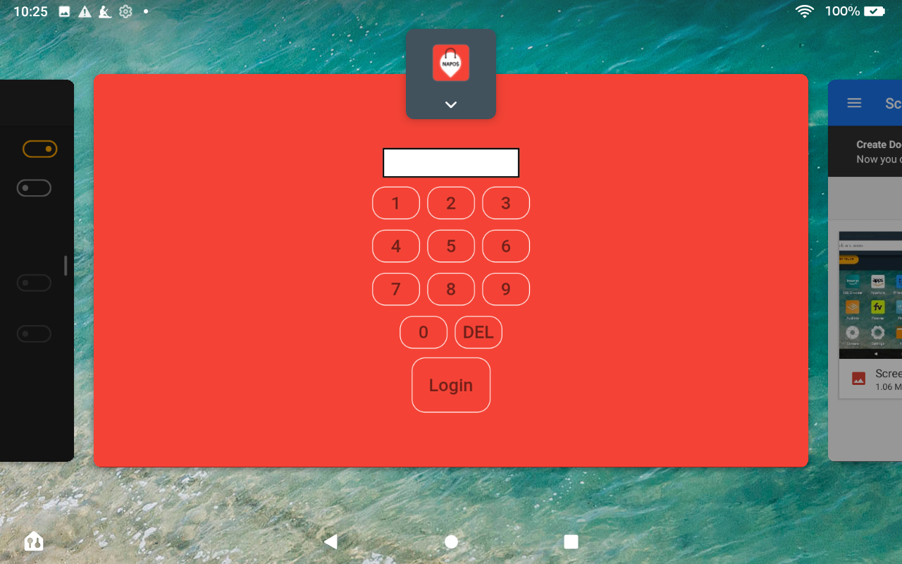
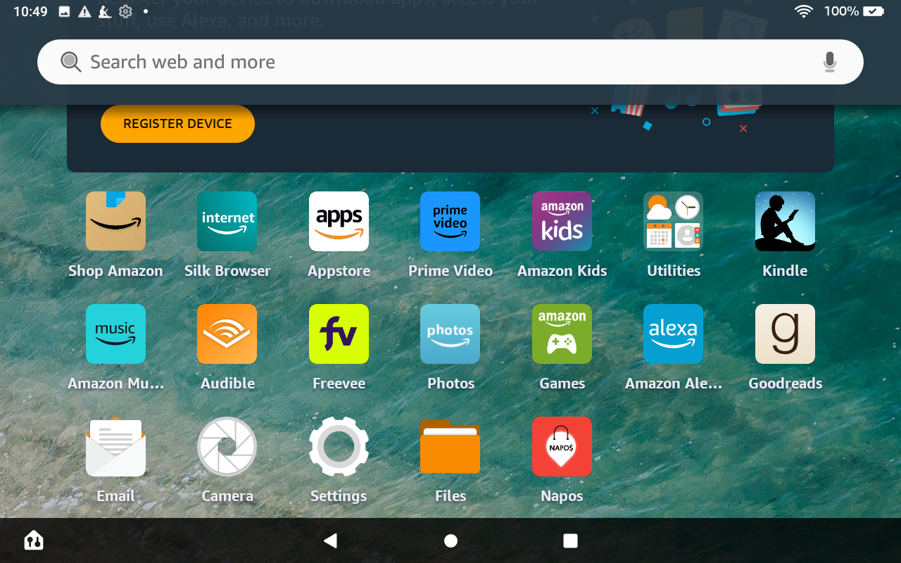

Login screen, the first page seen when the app is opened. User enters their pin. The user is then set until they log out. Placed orders will record who placed them.
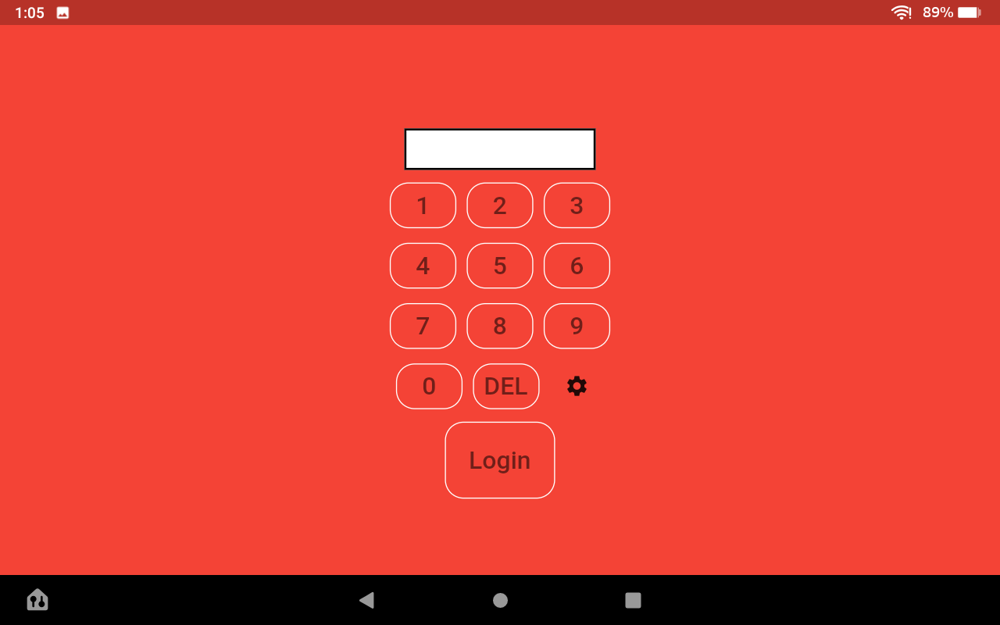

After logging, the user accesses the Home page. Each feature of the application can be accessed from here.
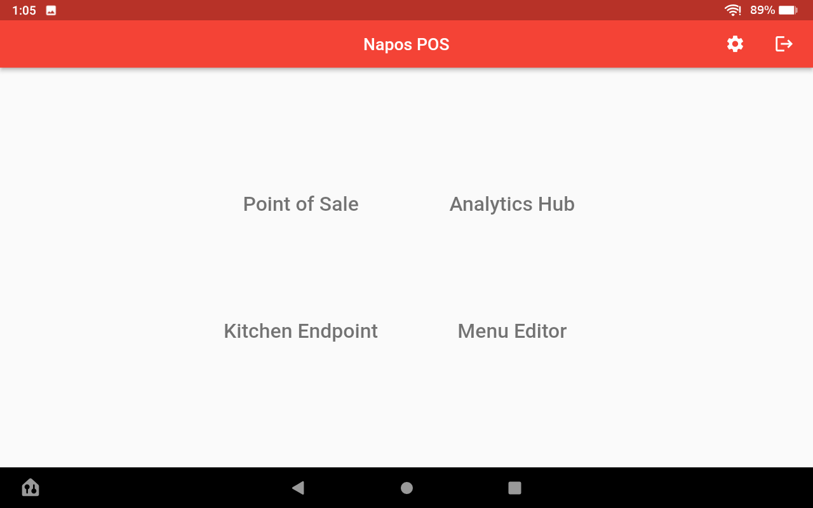

First is the Point of Sale/Command Hub. This is where orders are placed by a cashier. The interface is built to be adaptable, working on different resolutions and sizes. And accounting for menu items with long names. The category buttons act as filters for the menu, showing only the items tagged with the category. These are backed by data structures in Dart and mirrored in a MySQL database. An item can be in multiple categories. All items will appear when entering the page, or when 'All' is selected.
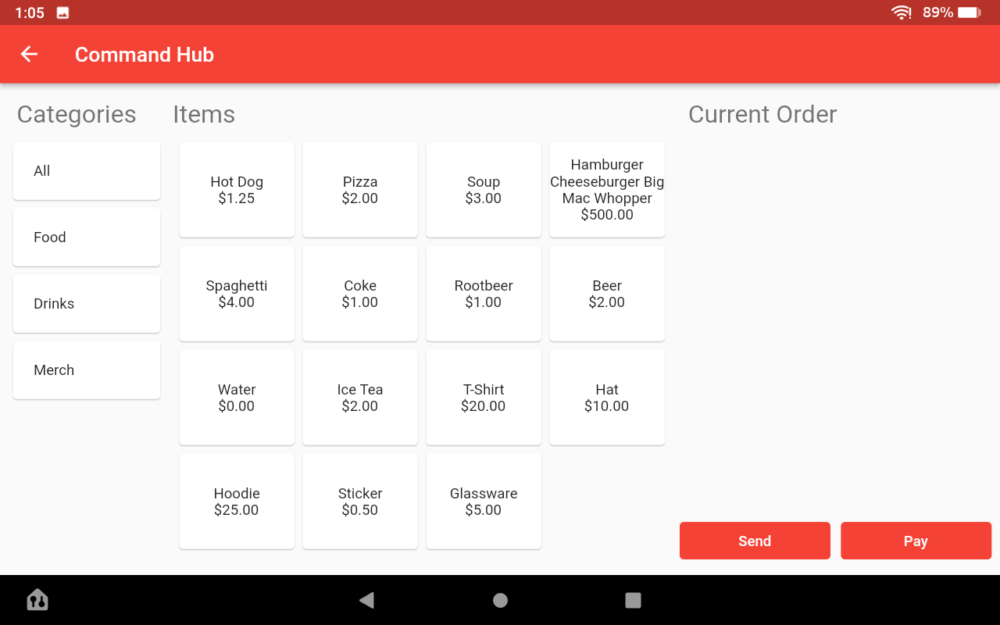

When an item is tapped, it will be added to the current order on the right side.
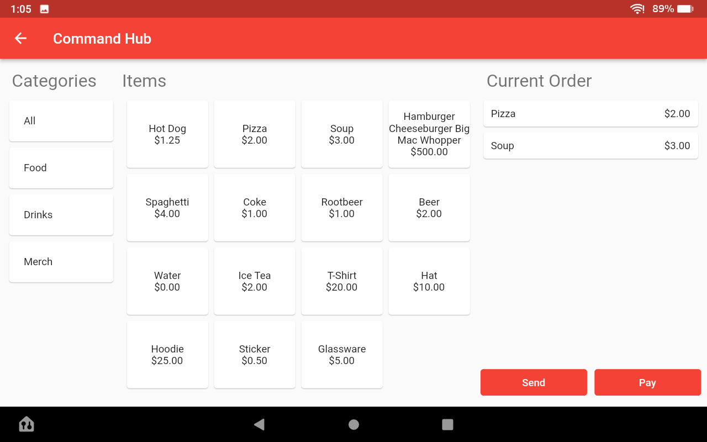

Tapping an item in the current order will allow it to be edited. Any relevant additions can be added, removed, or otherwise modified. These changes, as well as the total cost for including them, will be shown in the current order. Tapping pay will open the Square payment interface and allow the actual transaction to be completed.
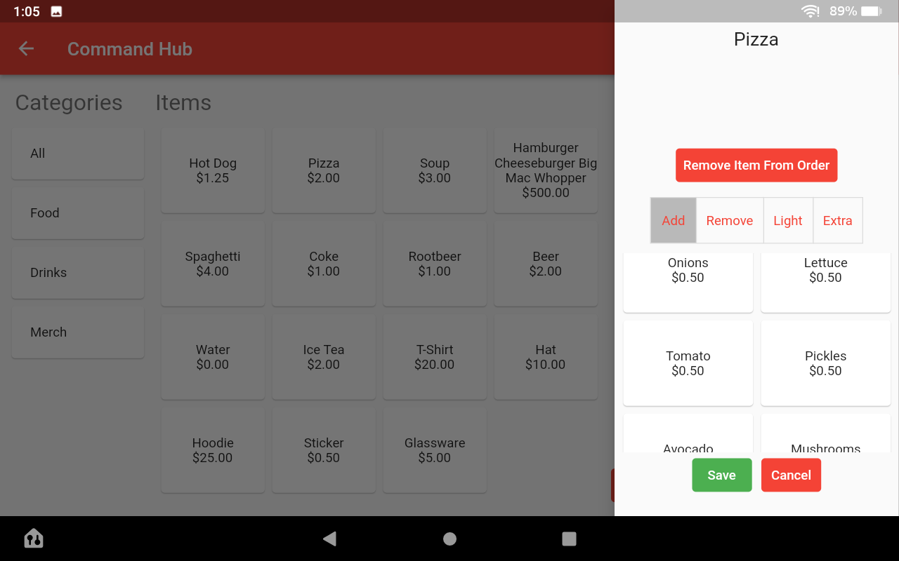
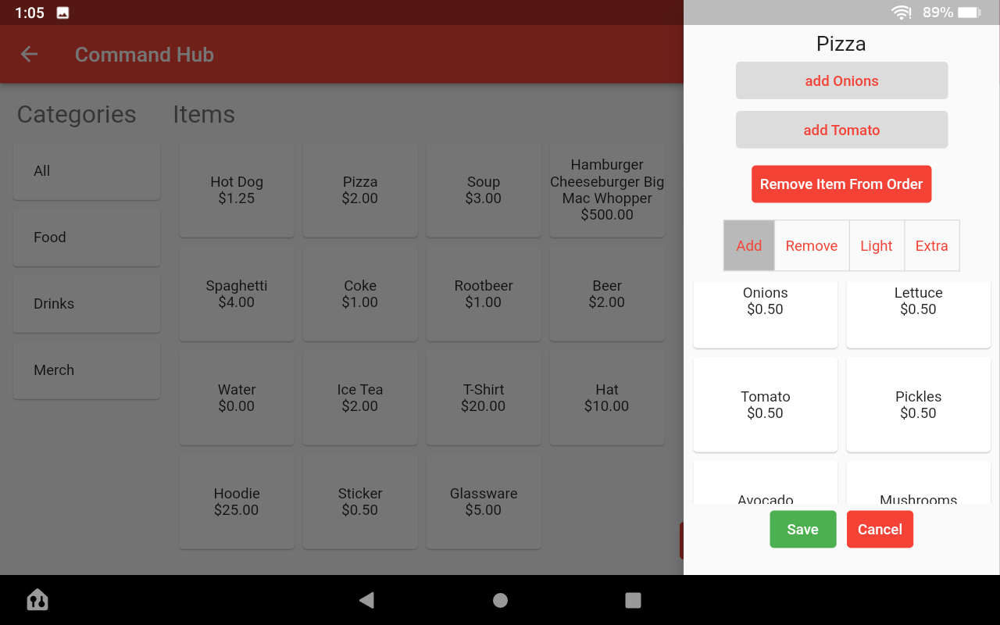

The second page, the Analytics Hub, is a business oriented page. It allows the user to view all previous orders that have been placed. More in depth features like filtering, sorting, were not implemented. Space for an inventory system was reserved, but the system was not created.
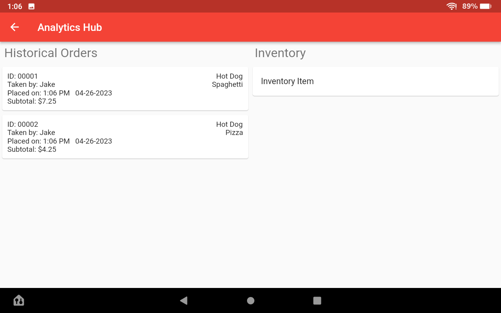

When an order is clicked on the Historical Orders list, this page is brought up detailing the selected order. The noting of the money transaction details was not implemented.
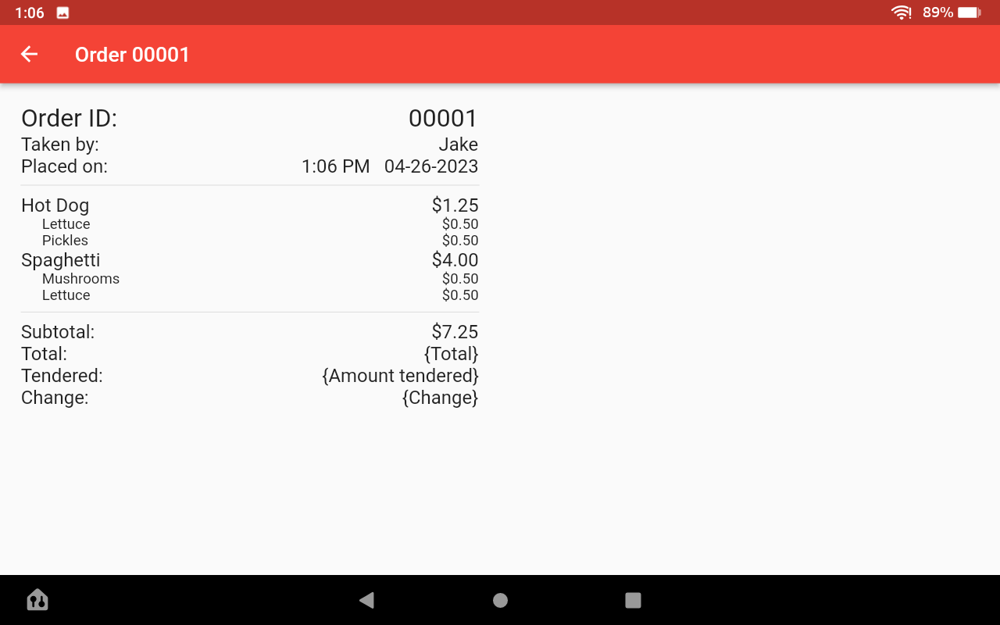

The Kitchen Endpoint is designed to be placed on its own device in the kitchen. Orders can be viewed once placed from the command hub and marked as completed. This feature being on the same app allows for easy set up and use.
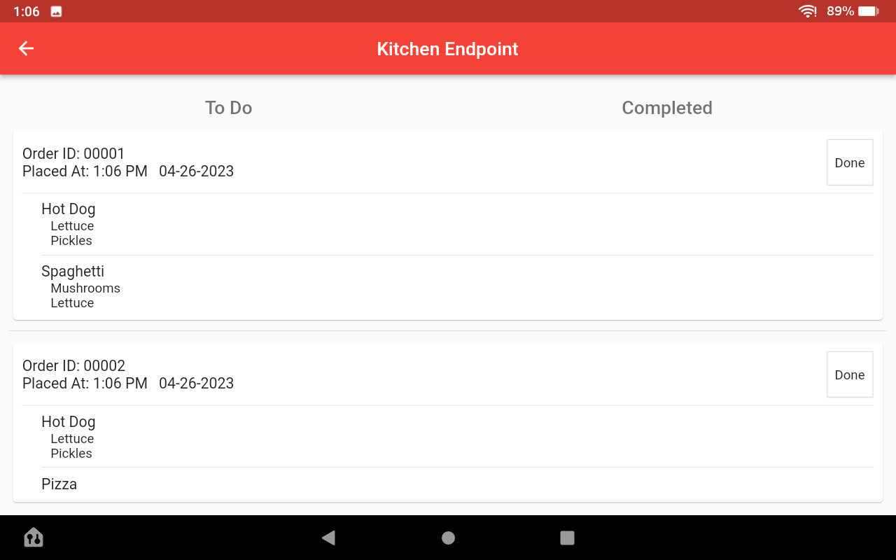

The Menu Editor is another business-side tool that allows the user to update the menu. Items can be added, deleted, and each piece can be changed. Same with additions. When an item is tapped on, it opens the editor for the item.
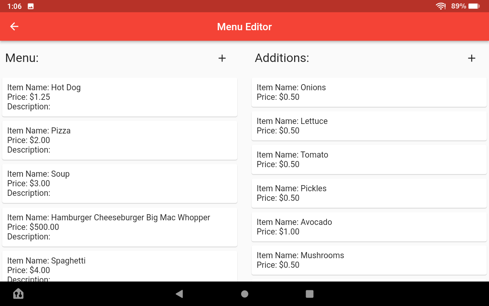
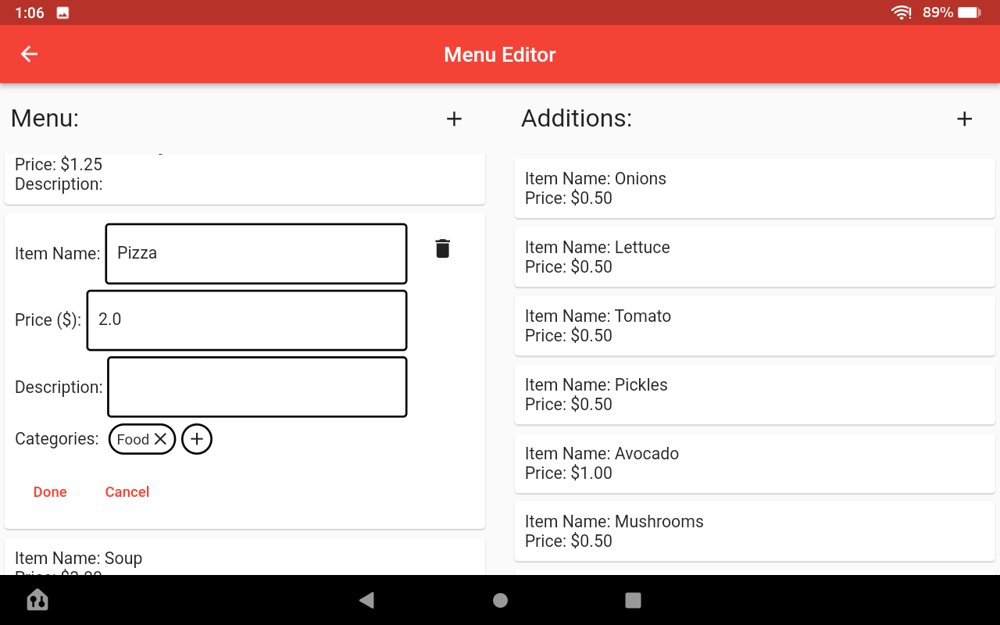

Prompt for adding a new item.
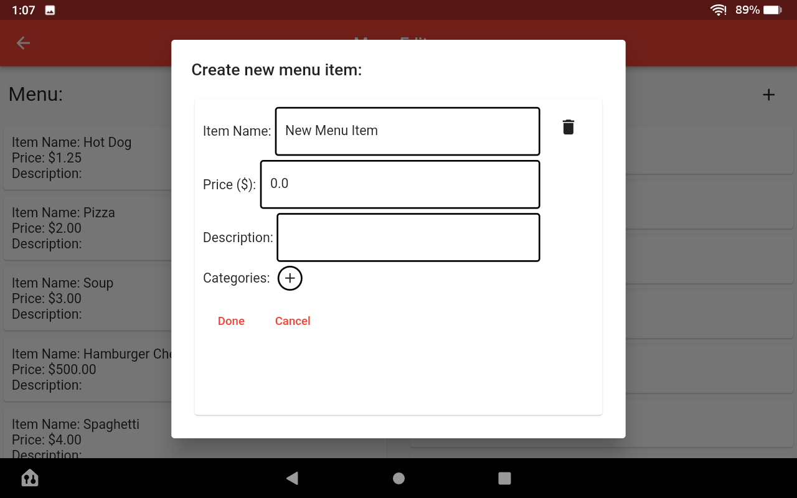

These changes are sent to the server. Since the command hub pulls the menu from the server, its content will then be updated.

## Developing with Flutter

Ensure you have Flutter and dart installed on your machine.
- [How to: Set up Flutter and dart on your Windows machine](https://docs.flutter.dev/get-started/install/windows)

To use Flutter commands outside of a Flutter terminal, you will have to add the full path to the Flutter SDK in you path environment variable.

- Use `> flutter doctor` to ensure your Flutter setup is working
- Use `> flutter devices` to see the devices currently connected to your machine. This will include browsers.
- Using `> flutter run` will run the project on the default machine.
- You can specify which device you want to run it on with `> flutter run -d [device name]`
- You can specify which file to run as an entry point with `> flutter run -t lib/[file name]`
- Once the program is running, pressing 'r' while focused on the terminal will hot reload the app, meaning you don't have to build it from scratch again. Variables stay the same value since the program is not restarted.
- Pressing 'Shift+r' will hot restart the app. Meaning it will fully rebuild (much faster than manually).

## References (For Development)

- [Importing packages into project](https://docs.flutter.dev/development/packages-and-plugins/using-packages)

- [Dart material library](https://api.flutter.dev/flutter/material/material-library.html)
- [Flutter layout widgets](https://docs.flutter.dev/development/ui/widgets/layout)

- [Multiple children solution](https://stackoverflow.com/questions/69841525/multiple-child-in-flutter)
- [Text Buttons (And another multiple children solution)](https://api.flutter.dev/flutter/material/TextButton-class.html)
- [Spacing elements](https://stackoverflow.com/questions/53141752/set-the-space-between-elements-in-row-flutter)
- [How Expanded Works](https://www.flutterbeads.com/listview-inside-column-in-flutter/#1-using-expanded-recommended)
